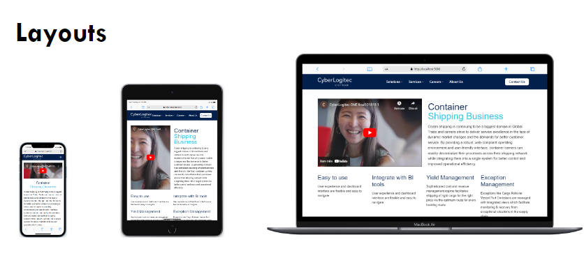

# CLT Shipping Landing Page

Ocean shipping is continuing to be a biggest domain in Global Trade and carriers strive to deliver service excellence in the face of dynamic market changes and the demands for better customer service. By providing a robust, web-compliant operating environment and user-friendly interface, container carriers can readily decentralize their processes across their shipping network while integrating them into a single system for better control and improved operational efficiency.

#

[](https://skillicons.dev)

## Goal

- Implemented by HTML5 & CSS3.
- Responsive on all devices.



## Installation

Firstly, install all app dependencies

```sh
npm install
```

In the project directory, you can run:

```sh
npm start
```

Runs the app in the development mode.\
Open [http://localhost:3000](http://localhost:3000) to view it in your browser.

The page will reload when you make changes.\
You may also see any lint errors in the console.

```sh
npm run build
```

## Docker

In the project directory, you can run:

```sh
docker compose up -d
```

Runs the app in the docker container.\
Open [http://localhost:3000](http://localhost:3000) to view it in your browser.

## Demonstration

This project is running in [clt.trankhaihoang.com](https://clt.trankhaihoang.com).
